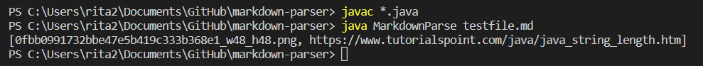
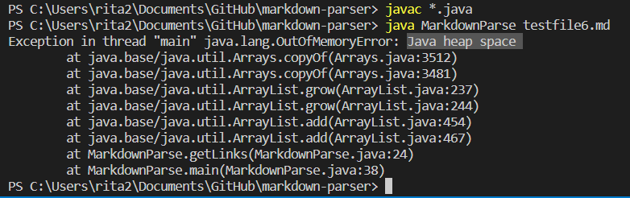
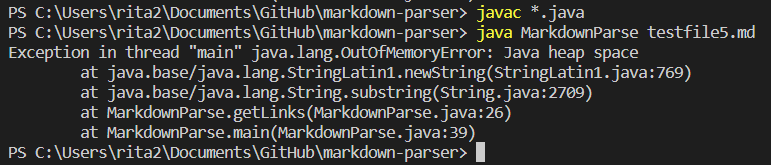

# LAB REPORT 2: Fixing Markdown-Parser 	
> By Rita Chang

## Code Version 1:


Code that prompted me to make that change: [Test File](https://github.com/shc031/markdown-parser/blob/23aba1af17767c7809737d11998a02a4dd4bee99/testfile.md)

Output of previous version

* Actual: ```[0fbb0991732bbe47e5b419c333b368e1_w48_h48.png, https://www.tutorialspoint.com/java/java_string_length.htm]```
* Expect: ```[https://www.tutorialspoint.com/java/java_string_length.htm]```

The previous version of Markdown-Parser first find the index of [, then find the index of ] after [, then the index ( after ], then the ) after (. Since the return arraylist will add the string from the index after ( to the index of ) and the program will not exclude anything that have ! in front of [], it will inculde everything in the () even if it's a picture. In the test file there's a picture command``````, the proggarm would also inculde the file name of the image which is a failure.

---	

## Code Version 2:


Code that prompted me to make that change: [Test File](https://github.com/shc031/markdown-parser/blob/2e23854b517ad4697a77189de0e0a853800bd403/testfile6.md)

Output of previous version

* Actual: ```(infinite loop)```
* Expect: ```[https://something.com]```

The previous version of Markdown-Parser will exclude eveything in the ```()``` when there is ```!``` in fornt of ```[```, but it will keep seaching even when there is no ```[``` sign becuase indexOf method will return -1 when the program could not find the string. This means when we run the the test file that have the code ```oko](some-thing.html)```, the program will keep adding some-thing.html to the arraylist causing infinity loop and leads to out of memory since ```openBracket``` will always be -1 and then it will search the ```]``` after the index -1. This error will be solve after we check if the openBracket is -1 or not.

---	

## Code Version 3:


Code that prompted me to make that change: [Test File](https://github.com/shc031/markdown-parser/blob/2e23854b517ad4697a77189de0e0a853800bd403/testfile5.md)

Output of previous version

* Actual: ```(infinite loop)```
* Expect: ```[]```

In this case we have the same error as last version, this time we break the infinity loop when there is no ```[```, but it did not break the loop when there is no ], (, or ). In the test case, we run through ```[(https://something.com)``` which means the program will keep adding some-thing.html to the arraylist causing infinity loop and leads to out of memory since ```closeBracket``` will always be -1 and then it will search the ```(``` after the index -1. This error will be solve after we check if the closeBracket is -1 or not.

