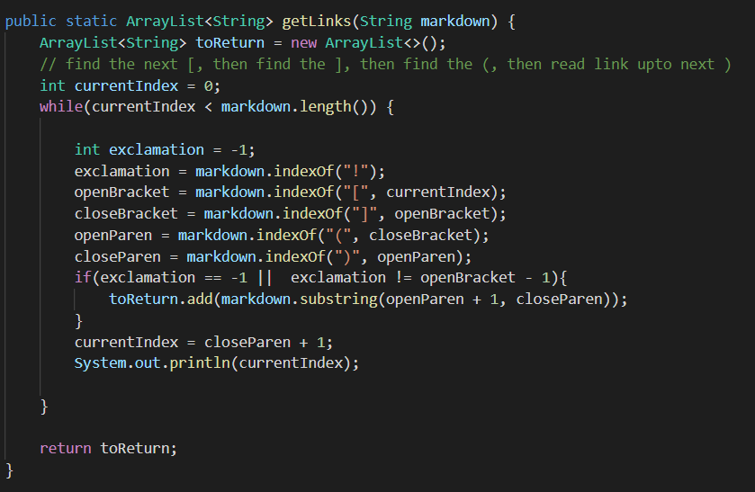
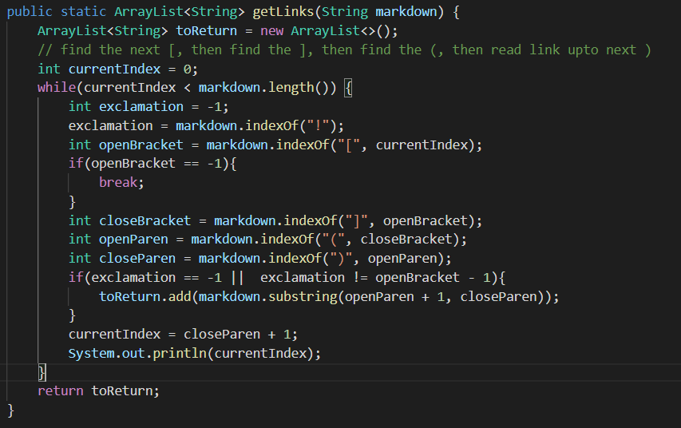
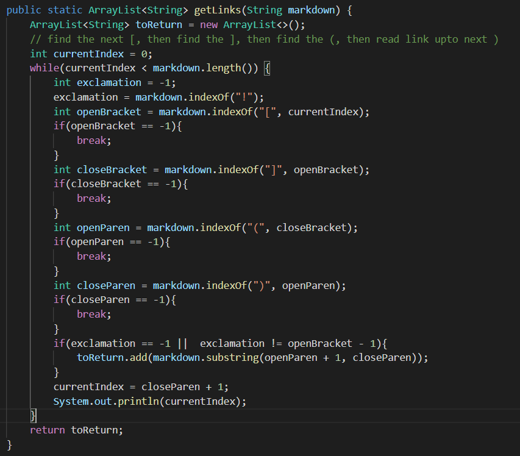

# LAB REPORT 2: Fixing Markdown-Parser 	
> By Rita Chang

## Code Version 1:


Code that prompted me to make that change: [Test File](https://github.com/shc031/markdown-parser/blob/23aba1af17767c7809737d11998a02a4dd4bee99/testfile.md)

Output of previous version
* Actual: ```[0fbb0991732bbe47e5b419c333b368e1_w48_h48.png, https://www.tutorialspoint.com/java/java_string_length.htm]```
* Expect: ```[https://www.tutorialspoint.com/java/java_string_length.htm]```

The previous version of Markdown-Parser include everything that is after [] and inside of (). Since the code for inserting images is ``````, it will also return the image file name.

---	

## Code Version 2:


Code that prompted me to make that change: [Test File](https://github.com/shc031/markdown-parser/blob/2e23854b517ad4697a77189de0e0a853800bd403/testfile6.md)

Output of previous version
* Actual: ```[https://something.com, https://something.com]```
* Expect: ```[https://something.com]```

The previous version of Markdown-Parser include everything in the ```()``` even when there is no ```[``` before ```]```. Since the program de will insert -1 as index when it did not find the code, it will continue run through the next line.

---	

## Code Version 3:


Code that prompted me to make that change: [Test File](https://github.com/shc031/markdown-parser/blob/2e23854b517ad4697a77189de0e0a853800bd403/testfile5.md)

Output of previous version
* Actual: ```(infinite loop)```
* Expect: ```[]```

The previous version of Markdown-Parser enter to an infinite loop. Since the fifth line is ```[(https://something.com)```, the 19th line```int closeBracket = markdown.indexOf("]", openBracket);``` will set closeBracket to -1 and run through the previous command line in testfile. This means it will not stop from adding the previous link to the arraylist.
