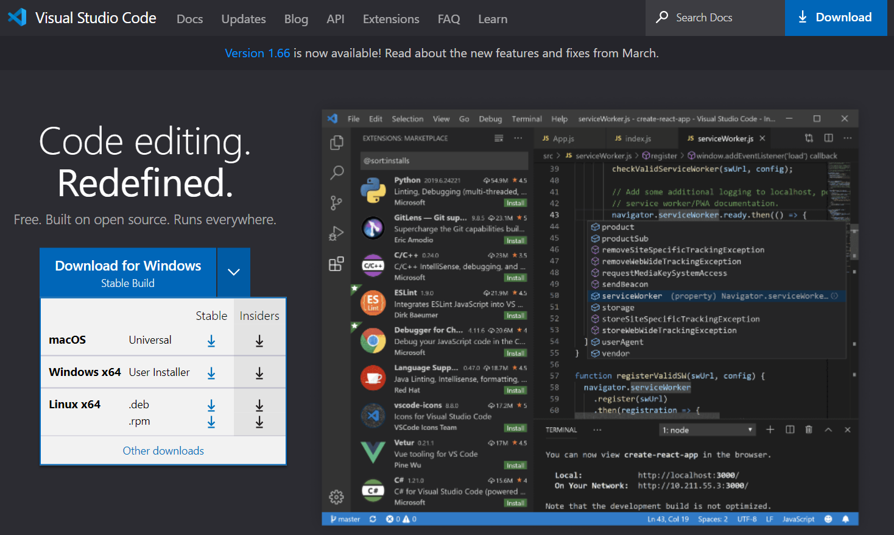
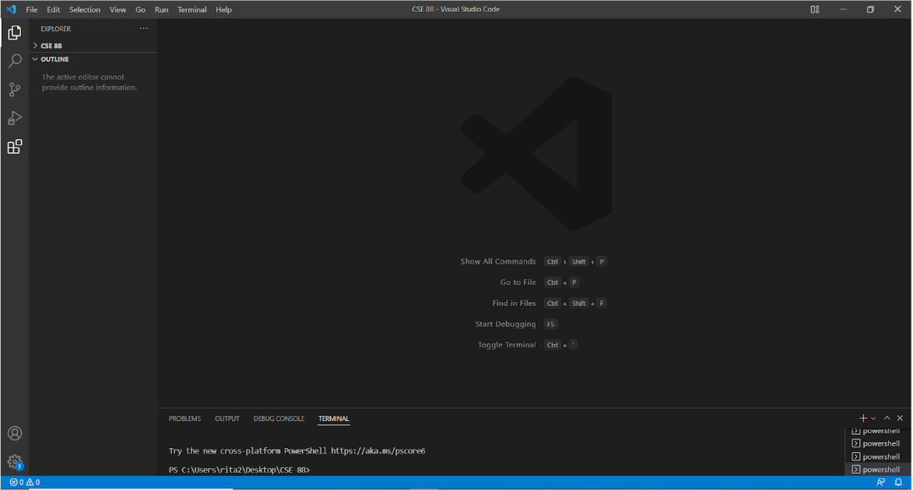
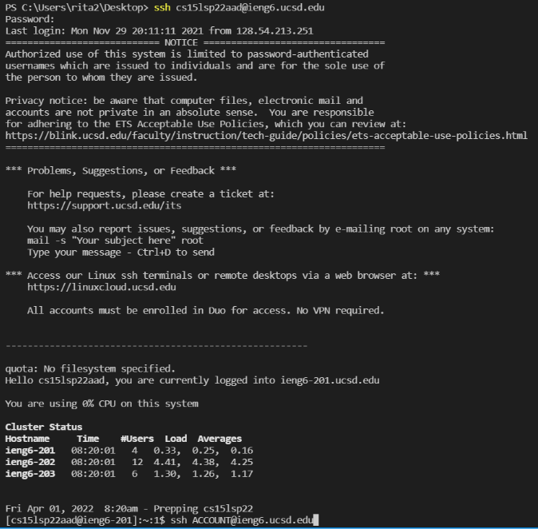
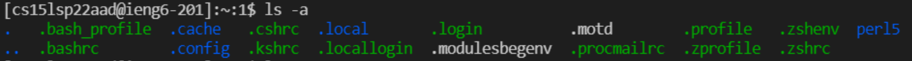
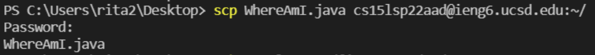
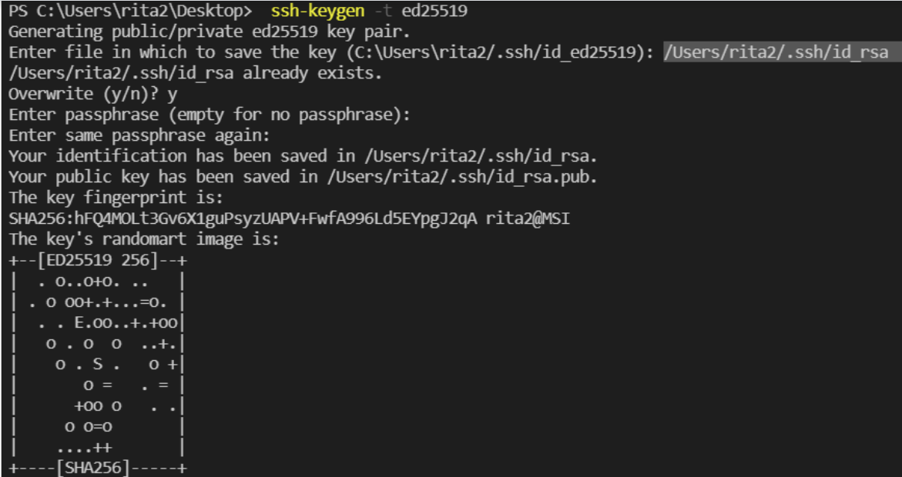
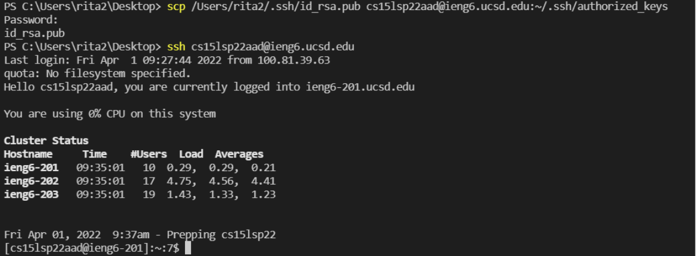
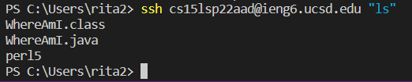

# LAB REPORT 1 	
> By Rita Chang


## Installing VScode

Go to [**Visual Studio Code - Code Editing. Redefined**](https://code.visualstudio.com/) and press download.

	
It should look like this after you open it:



---	

## Remotely Connecting
If you don't know your course-specific account for CSE15L, check out [Here](https://sdacs.ucsd.edu/~icc/index.php).

To connect to course-specific account on ieng6, follow these steps:

* Open Visual Studio Code
* Press Terminal
* Press New Terminal
* Type in the command `ssh` with user name of course-specific account on ieng6 after space `(EX: ssh cc15lsp22xxx@ieng6.ucsd.edu)`
* If `"Are you sure you want to continue connecting"`  appear, enter `yes`.
* Enter the password
* Now you are successfully connect to the server!




---	

## Trying Some Commands
Now, you can try out some different commands on your computer and on ieng6.
> Log out from server: Ctrl-D/Run the command exit

Try out the commands in your terminal, such as ls -a(shows every item in the computer including hidden files):



Try out other commands:
* cd: change directory
* ls: list out the files
* pwd: check the working directory(relative paths)
* mkdir: make directory
* cp: copy
* rm: remove

---	

## Moving Files with scp
In your computer(not server), run the command `scp`:
```
scp (file name) cc15lsp22xxx@ieng6.ucsd.edu:~/
```
Then enter your ieng6 password, you are now successfully moveing the file to ieng6.



---	

## Setting an SSH Key
ssh keys also called ssh-keygen creates public and private key which allows you to login to the server without password.

* Run the command `ssh-keygen` for Mac and `ssh-keygen -t ed25519` for Windows.
* Enter file in which to save the key (/Users/<user-name>/.ssh/id_rsa): `/Users/<user-name>/.ssh/id_rsa`
* Do **NOT** enter a passphrase when it asking for it(empty for no passphrase)
* Press enter when it ask you to enter same passphrase again


Copy the **public** ssh key to the .ssh directory in your server.
* Login to ieng6 and run the command `mkdir .ssh`.
* Now go back to your own computer and run the command `scp /Users/<user-name>/.ssh/id_rsa.pub cs15lsp22zz@ieng6.ucsd.edu:~/.ssh/authorized_keys`
* Now you can run the command ssh and scp without entering the password! 


---	

## Optimizing Remote Running
* At the end of `ssh` command, you can enter another command in the `quote` to run directly run it in the server



* By running multiple commands at once, use semicolons to seperate the them and press enter
* Pressing the up-arrow could call the last command you entered.