# LAB REPORT 3 	
> By Rita Chang

## Streamlining ssh Configuration
> I create a file of ```.ssh/config``` with hostname and user name. 

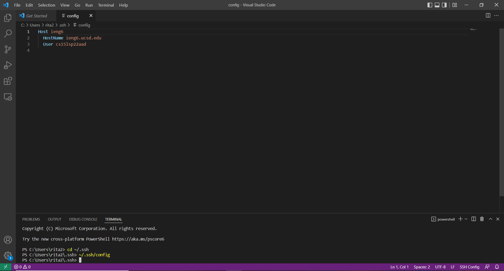	

> This way when I want to login to the remote server, I could just use the ssh command with ieng6(the name after ```Host``` to ) without typing out the whole hostname and user name.

	

> I could also run the ```scp``` command with ```(Name after Host):~/```.

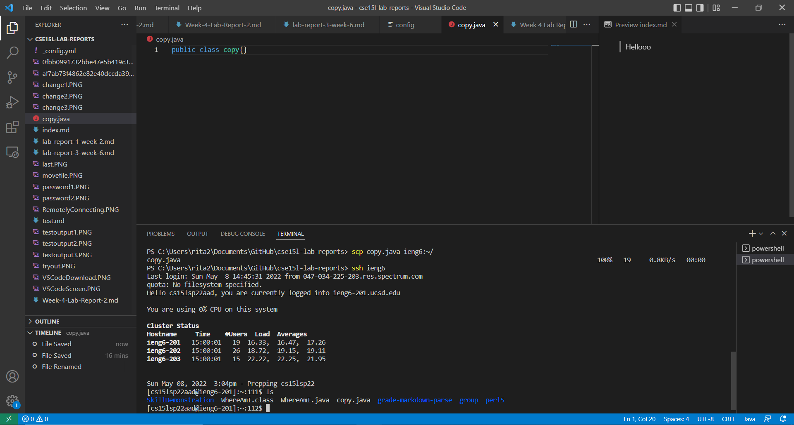	

---

## Setup Github Access from ieng6

The private key and private key is stored in .ssh on my user account:
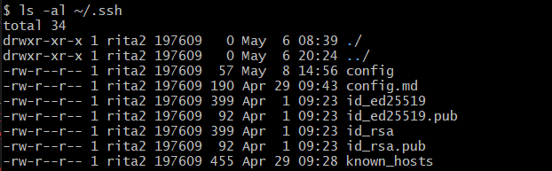	

Public key you made is stored on Github:
	

Running git commands to commit and push a change to Github while logged into your ieng6 account:
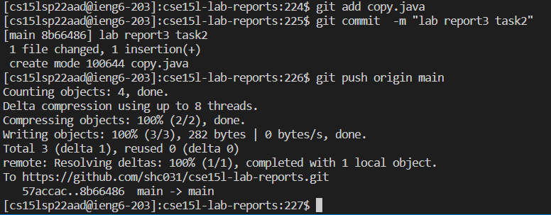	

[Resulting Commit](https://github.com/shc031/cse15l-lab-reports/commits/main)

---	

## Copy whole directories with scp -r

I run scp command and copy my whole markdown-parse directory to my ieng6
account:

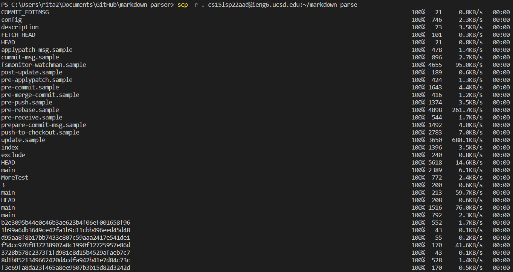

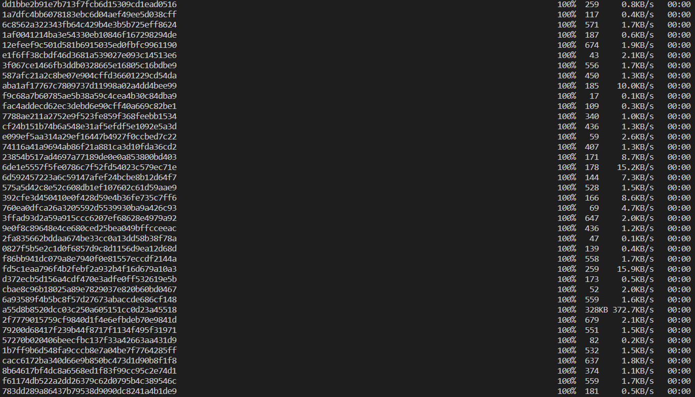

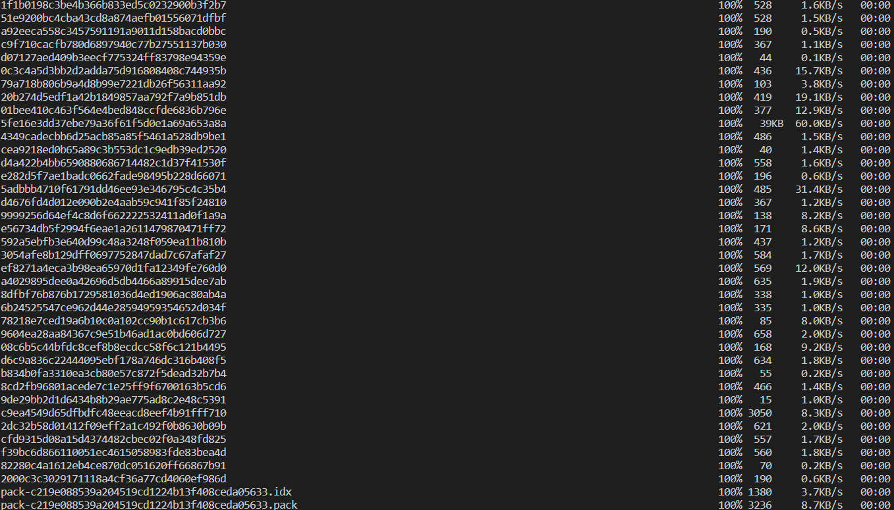	

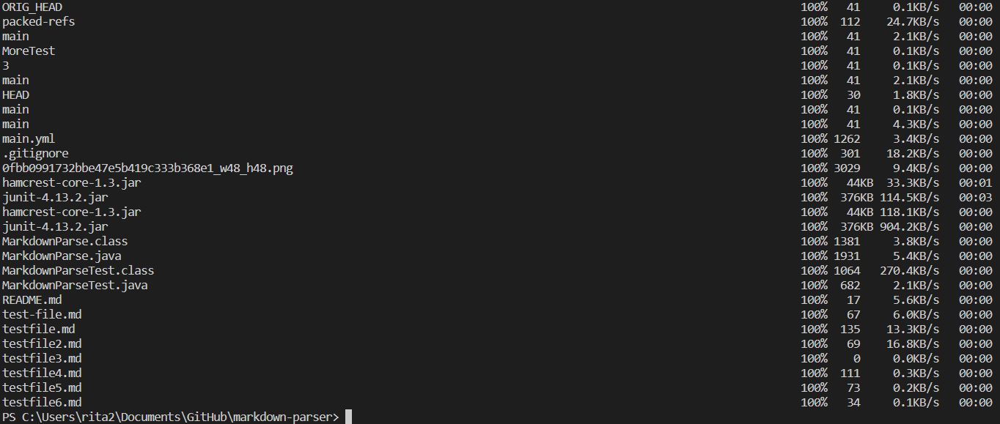	


I log into my ieng6 account after doing this and compiling and running the tests for my repository by going to my markdown-parse directory and run javac, java command:

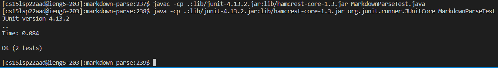

I try to combined scp, ;, and ssh to copy the whole directory and run the tests in one line, but it does not work.

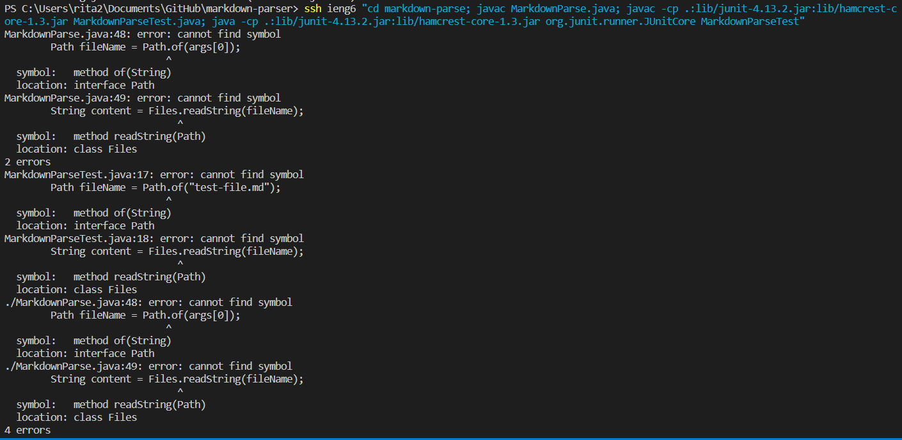

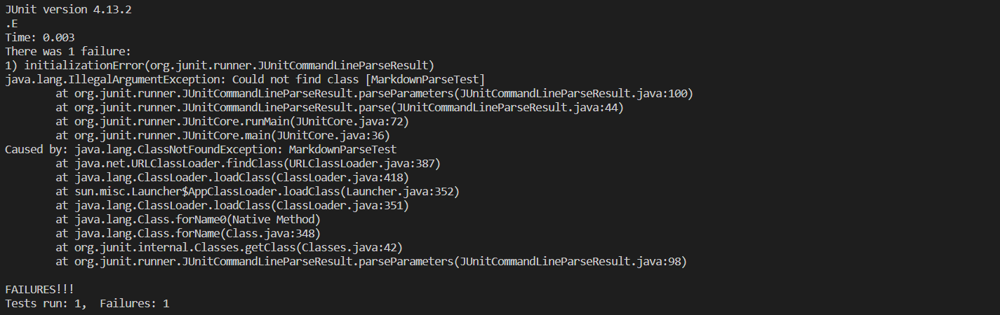

(I went to office hour, but the problem did not solve, Tutor: Yukati Gupta told me to write this down in my lab report)

It does not work when I run ```scp -r . cs15lsp22aad@ieng6.ucsd.edu:~/markdown-parse; ssh cs15lsp22aad@ieng6.ucsd.edu “cd markdown-parse; javac -cp .:lib/junit-4.13.2.jar:lib/hamcrest-core-1.3.jar MarkdownParseTest.java; java -cp .:lib/junit-4.13.2.jar:lib/hamcrest-core-1.3.jar org.junit.runner.JUnitCore MarkdownParseTest”```.

However, it works when I did ```scp -r . cs15lsp22aad@ieng6.ucsd.edu:~/markdown-parse; ssh cs15lsp22aad@ieng6.ucsd.edu ``` first. 

Then, ```cd markdown-parse; javac -cp .:lib/junit-4.13.2.jar:lib/hamcrest-core-1.3.jar MarkdownParseTest.java; java -cp .:lib/junit-4.13.2.jar:lib/hamcrest-core-1.3.jar org.junit.runner.JUnitCore MarkdownParseTest```.

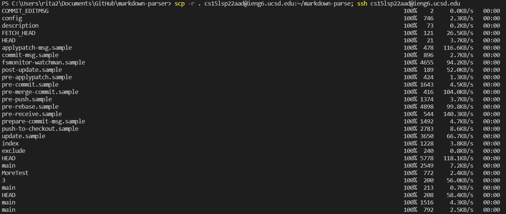

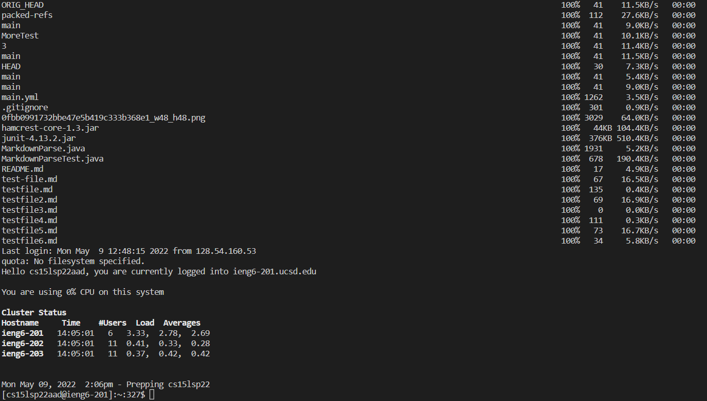

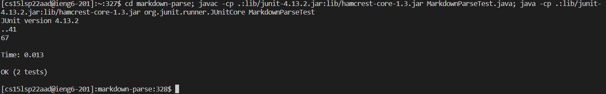


