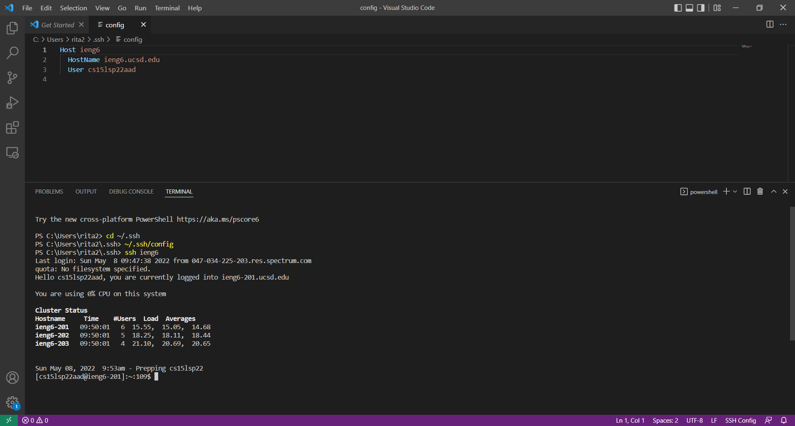

# LAB REPORT 3 	
> By Rita Chang

## Streamlining ssh Configuration
> I create a file of ```.ssh/config``` with hostname and user name. 

	

> This way when I want to login to the remote server, I could just use the ssh command with ieng6(the name after ```Host``` to ) without typing out the whole hostname and user name.

	

> I could also run the ```scp``` command with ```(Name after Host):~/```.

	

---

## Setup Github Access from ieng6

The private key and private key is stored in .ssh on my user account:
	

Public key you made is stored on Github:
	

Running git commands to commit and push a change to Github while logged into your ieng6 account:
	

[Resulting Commit](https://github.com/shc031/cse15l-lab-reports/commits/main)

---	

## Copy whole directories with scp -r

