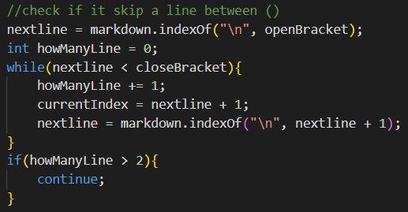

# LAB REPORT 3

> By Rita Chang

---

## Markdown-parse Repository

> [My Repository](https://github.com/shc031/markdown-parser)

> [Repository I Reviewed](https://github.com/ddn005UCSD/markdown-parser)

---

## Expected Output for Snippet

* Snippet 1 Expected: ``[`google.com, google.com, ucsd.edu]``

* Snippet 2 Expected: `[a.com, a.com(()), example.com]`

* Snippet 3 Expected: `[https://sites.google.com/eng.ucsd.edu/cse-15l-spring-2022/schedule]`

Test in MarkdownParseTest.java:

My implementation: Did not pass

The implementation I reviewed in Week 7: Did not pass

## Possibility for Small Code Change

* Snippet 1: I think there is a small code change that will make my program work for snippest 1, but not all related cases that use inline code with backticks. I could find if there are two backticks that contains ( and set the current index to the index after two backticks. However I am not able to check both ( and [ with less than 10 lines becuase I am not able to check ( and [ at the smae time.

* Snippet 2: I think there is a small code change that will make my program work for snippest 2, but not all related ases that nest parentheses, brackets, and escaped brackets. I could check the nest parentheses by checking if there is () inside of (). Since it took me around 10 lines to check it, I do not think a samll code change can check all nest parentheses, brackets, and escaped brackets.

* I do not think there is a small code change that will make my program work for snippest 3 and all related cases that have newline in brackets and paretheses. Since it has to check if there is extra line between () and [], and exclude thoses lines during the adding URL process, I believe it will takes more than 10 lines to do it.

---

## Code Changes that Allowed the Tests to Pass

* Snippet 1: Find the first backtick in front of ( and the second backtick in the same. If the test file have such a case, set current index to here the second backtick is and strat the next loop.

---

* Snippet 2: Check if the URL contains () without skipping a line. If it does, set the closeParen to the last ), so it will add the right URL to the arraylist.

---

* Snippet 3:

First check how many lines does the file skip between ( and ) by loop and set the currentIndex to the beginning of the mext line everytime when it enter to the loop. If it skip more than two lines, the program will run the continue command and start another loop of outer while loop.

Second check how may lines does the file skip between [ and ] by loop and set the currentIndex to the beginning of the mext line everytime when it enter to the loop. If it skip more than two lines, the program will run the continue command and start another loop of outer while loop.

If it only skip two lines between (), the program will add the URL from the begging of the next line and before it skip another line, which means the URL in arraylist will not have extra line.

