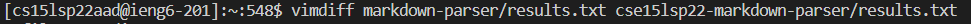
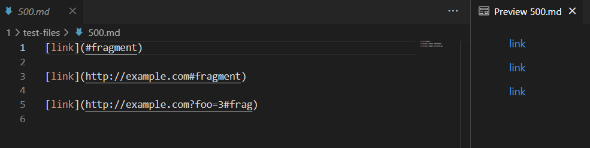
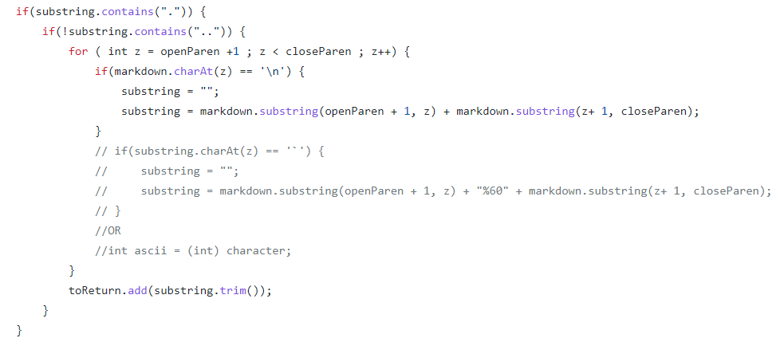
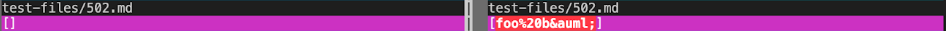
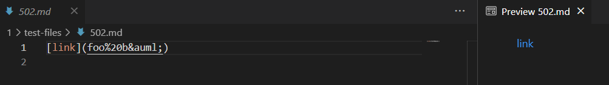

# LAB REPORT 5

> By Rita Chang

---

### I found the tests with different results by using vimdiff on the results of running a bash for loop. I searched through manually.



### The test-file with different-results:

* [500.md](https://github.com/nidhidhamnani/markdown-parser/blob/main/test-files/500.md?plain=1r)

* [502.md](https://github.com/nidhidhamnani/markdown-parser/blob/main/test-files/502.md?plain=1)

---

## 500.md:


The implementation on the right(cse15lsp22-markdown-parser) is correct. The expected output is ```[#fragment, http://example.com#fragment, http://example.com?foo=3#frag]```.



The implementation on the left returns [http://example.com#fragment, http://example.com?foo=3#frag] which is wrong. Since it's MarkdownParse check if the URL includes `.` before adding to the String, `#fragment` did not pass thorugh the first if statement.



## 502.md:



The implementation on the right(cse15lsp22-markdown-parser) is correct. The expected output is ```[foo%20b&auml;]```.



The implementation on the left returns [] which is wrong. Since it's MarkdownParse check if the URL includes `.` before adding to the String, `foo%20b&auml;` did not pass thorugh the first if statement.


